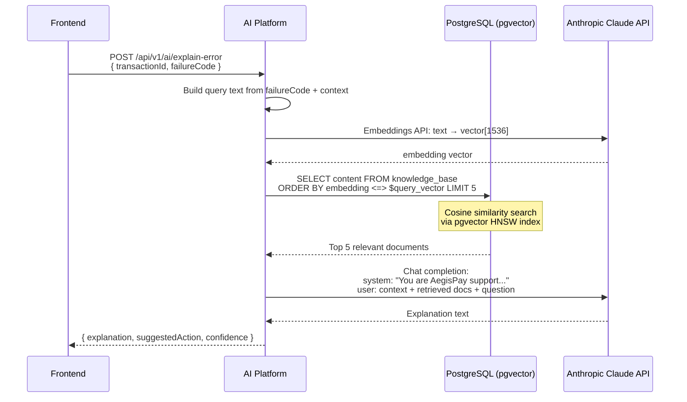

# AegisPay — AI Platform

The AI Platform is a Spring Boot service that provides AI-augmented capabilities: fraud explanation, error resolution, incident triage, and KYC assistance. It does **not** make autonomous decisions — all final decisions remain with deterministic rule engines. AI is used for **explanation and augmentation**, not control.

---

## Architecture

```
AI Platform (port 8091)
│
├─ RAG Engine
│   ├─ Embeddings: text → vector via Anthropic Embeddings API
│   ├─ Vector Store: pgvector (cosine similarity search)
│   └─ Generation: Claude claude-3-5-sonnet via Anthropic API
│
├─ Fraud Copilot
│   └─ RAG over historical fraud cases
│       "Why was this transaction flagged?"
│
├─ Error Resolution Agent
│   └─ RAG over error pattern knowledge base
│       Maps failureCode → plain English explanation + suggested action
│
├─ Incident Triage Agent (Agentic)
│   └─ Tool-use loop: read logs → query metrics → summarise root cause
│
└─ KYC OCR
    └─ Multimodal: send document image → extract structured fields
        Detect tampering, blur, coverage
```

---

## RAG Flow



---

## Fraud Copilot

**Problem**: The Risk Engine returns `riskScore=78, decision=BLOCK, ruleFlags=["HIGH_VELOCITY","NEW_DEVICE"]`. A human reviewing this needs to understand *why* — what historical patterns make these flags suspicious?

**Solution**: RAG over a knowledge base of:
- Past confirmed fraud cases (anonymised)
- Rule trigger explanations
- Industry fraud pattern documentation

The copilot returns: *"This pattern matches 23 historical fraud cases. High-velocity transactions from new devices on first payee contact have a 78% fraud rate in our dataset. Recommend: request additional OTP verification before proceeding."*

---

## Error Resolution Agent

**Problem**: Stripe returns `amount_too_small`. The user sees "Payment failed." — unhelpful.

**Solution**: AI Platform maps the `failureCode` to a user-friendly explanation:

| failureCode | AI explanation | Suggested action |
|-------------|---------------|-----------------|
| `amount_too_small` | "The payment amount (₹30) is below the minimum allowed for INR transactions (₹50)" | "Increase the amount to at least ₹50" |
| `INSUFFICIENT_FUNDS` | "Your AegisPay wallet balance (₹20) is less than the payment amount (₹500)" | "Add money to your wallet first" |
| `RISK_BLOCKED` | "This transaction was blocked by our fraud detection system. Unusual activity was detected." | "Contact support if you believe this is an error" |

The frontend's "AI Assistant" panel calls this endpoint when a transaction fails, displaying the explanation automatically.

---

## Vector Store Schema

```sql
-- In aegispay_ai database
CREATE EXTENSION IF NOT EXISTS vector;

CREATE TABLE knowledge_base (
    id          UUID PRIMARY KEY DEFAULT gen_random_uuid(),
    category    VARCHAR(50) NOT NULL,  -- 'fraud_pattern', 'error_resolution', 'kyc_guidance'
    content     TEXT NOT NULL,
    embedding   vector(1536),          -- OpenAI ada-002 or Anthropic embedding dimensions
    metadata    JSONB,
    created_at  TIMESTAMP DEFAULT now()
);

CREATE INDEX ON knowledge_base USING hnsw (embedding vector_cosine_ops)
WITH (m = 16, ef_construction = 64);
```

---

## On-Prem vs Cloud

| Environment | AI Provider | Model |
|-------------|------------|-------|
| Prod | Anthropic API directly | claude-3-5-sonnet-20241022 |
| Dev (k3s) | OpenRouter (cost-optimised proxy) | meta-llama/llama-3.1-8b-instruct:free |

Dev uses `OPENROUTER_API_KEY` from Vault. The `springProfile: dev` flag activates `application-dev.yml` which switches the Spring AI configuration to use the OpenRouter base URL.

---

## Why RAG over Fine-Tuning?

| Aspect | Fine-tuning | RAG (AegisPay approach) |
|--------|------------|------------------------|
| Knowledge update | Requires retraining | Add a row to `knowledge_base` |
| Explainability | Black box | Retrieved documents are logged |
| Cost | Expensive to retrain per update | Only embedding cost for new documents |
| Latency | Low (no retrieval) | ~200ms extra for retrieval |
| Data privacy | Training data sent to provider | Only query + retrieved chunks sent |

For a financial system, explainability (knowing *which* historical cases influenced a decision) is more important than latency savings from fine-tuning.
