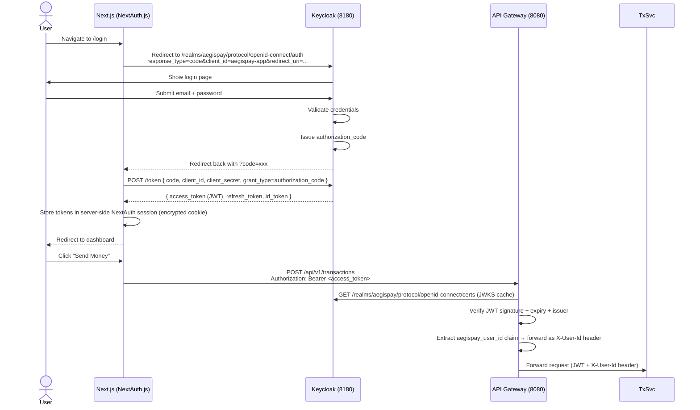

# AegisPay — Authentication & Authorization Flow

---

## Auth Stack

| Layer | Technology | Role |
|-------|-----------|------|
| Identity Provider | Keycloak 24 | Issues JWTs, manages user sessions, federates external IdPs |
| API Gateway | Spring Cloud Gateway + Spring Security | Validates JWT signature (JWKS), rejects invalid tokens |
| Services | Spring Security Resource Server | Trusts gateway-validated JWT, extracts claims for authz |
| Frontend | NextAuth.js | Manages browser session, refreshes tokens, handles redirects |

---

## Login Flow (First-Party — Email + Password)



---

## JWT Claims Structure

Keycloak issues tokens with custom claims added via Protocol Mapper:

```json
{
  "sub": "59295e61-a284-40ed-8d3b-9e15bedeb040",  ← Keycloak UUID
  "aegispay_user_id": "59295e61-a284-40ed-8d3b-9e15bedeb040",  ← mapped to domain userId
  "email": "customer@aegispay.local",
  "given_name": "Test",
  "family_name": "Customer",
  "realm_access": {
    "roles": ["CUSTOMER"]
  },
  "iss": "http://localhost:8180/realms/aegispay",
  "aud": "aegispay-app",
  "exp": 1747389600,
  "iat": 1747386000
}
```

Services extract `aegispay_user_id` (not `sub`) for all domain operations — this decouples the Keycloak session ID from the domain user ID.

---

## Multi-IdP Federation

Keycloak acts as a broker for external identity providers. From the application's perspective, **all social logins produce the same JWT structure** — the IdP-specific token is hidden inside Keycloak.

```
User clicks "Sign in with Google"
  → Keycloak redirects to Google OAuth2
  → Google authenticates, returns code to Keycloak
  → Keycloak maps Google profile → Keycloak user
  → Keycloak issues AegisPay JWT (same structure as password login)
  → Application receives standard JWT — no Google-specific handling needed
```

Supported IdPs (configured in `realm-export.json`):
- Google
- Microsoft (Azure Entra ID)
- GitHub
- Apple

---

## Authorization Model

**Role-based** (from JWT `realm_access.roles`):

| Role | Can do |
|------|--------|
| `CUSTOMER` | Send/receive money, view own transactions, access AI assistant |
| `MERCHANT_OPERATOR` | View own merchant transactions, access reconciliation reports |
| `BACK_OFFICE` | View all transactions, manage disputes, access admin dashboard |
| `ADMIN` | Full access including user management, system config |
| `PARTNER` | API access via client_credentials grant, scoped to partner endpoints |

**Actor-based** (for sensitive operations): even with `BACK_OFFICE` role, accessing another user's transaction requires an explicit `actorContext` audit log entry. The `ActorContext` ThreadLocal records who performed each action for the audit trail.

---

## Token Refresh

NextAuth.js handles token refresh transparently:

1. Before each API call, NextAuth checks if `access_token` expires within 60 seconds
2. If yes, it calls `POST /realms/aegispay/protocol/openid-connect/token` with `grant_type=refresh_token`
3. New tokens are stored in the encrypted session cookie
4. The refresh fails → NextAuth marks session as expired → user redirected to login

---

## Rate Limiting

API Gateway enforces per-user rate limits using Redis:

```
Key:   rate:limit:{userId}:{endpoint_group}
Value: INCR counter with EXPIRE = windowSeconds
Check: if counter > maxRequests → 429 Too Many Requests
```

Default limits (configurable per `values.yaml`):
- `maxRequests: 100` per `windowSeconds: 60` per user across all endpoints

---

## WebSocket Authentication

Standard HTTP auth doesn't apply to WebSocket frames after the initial handshake. See [notification-flow.md](notification-flow.md) for the STOMP channel interceptor approach used by Notification Service.

---

## Security Headers

API Gateway adds security headers to all responses:
- `X-Content-Type-Options: nosniff`
- `X-Frame-Options: DENY`
- `Strict-Transport-Security: max-age=31536000` (prod only)
- `Content-Security-Policy: default-src 'self'`
- `X-Correlation-Id: {uuid}` — for distributed tracing correlation
