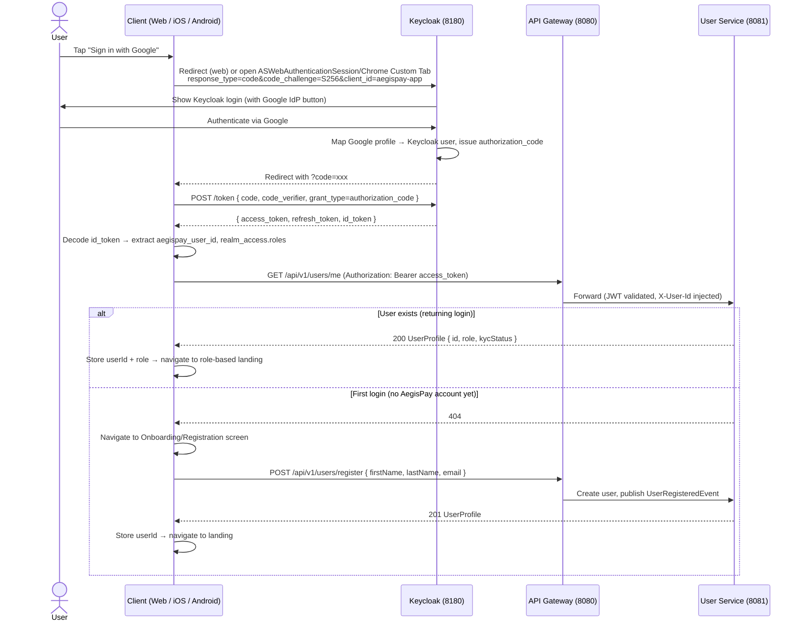

# AegisPay — Authentication & Authorization Flow

---

## Auth Stack

| Layer | Technology | Role |
|-------|-----------|------|
| Identity Provider | Keycloak 24 | Issues JWTs, manages user sessions, federates external IdPs |
| API Gateway | Spring Cloud Gateway + Spring Security | Validates JWT signature (JWKS), rejects invalid tokens |
| Services | Spring Security Resource Server | Trusts gateway-validated JWT, extracts claims for authz |
| Frontend | NextAuth.js | Manages browser session, refreshes tokens, handles redirects |

---

## Login Flow — PKCE (all clients)

AegisPay uses **OAuth 2.0 Authorization Code + PKCE** exclusively. There is no username+password login — all authentication goes through Keycloak (which federates Google, Microsoft, GitHub, Apple). This applies to Web, iOS, and Android identically.



### Role-based landing after login

| Role | Web | iOS | Android |
|------|-----|-----|---------|
| `CUSTOMER` | `/dashboard` | Home tab (0) | `Route.DASHBOARD` |
| `BACK_OFFICE` | `/backoffice` | Admin tab (6) | `Route.BACK_OFFICE` |
| `ADMIN` | `/triage` | Triage tab (7) | `Route.TRIAGE` |

---

## JWT Claims Structure

Keycloak issues tokens with custom claims added via Protocol Mapper:

```json
{
  "sub": "59295e61-a284-40ed-8d3b-9e15bedeb040",  ← Keycloak UUID
  "aegispay_user_id": "59295e61-a284-40ed-8d3b-9e15bedeb040",  ← mapped to domain userId
  "email": "customer@aegispay.local",
  "given_name": "Test",
  "family_name": "Customer",
  "realm_access": {
    "roles": ["CUSTOMER"]
  },
  "iss": "http://localhost:8180/realms/aegispay",
  "aud": "aegispay-app",
  "exp": 1747389600,
  "iat": 1747386000
}
```

Services extract `aegispay_user_id` (not `sub`) for all domain operations — this decouples the Keycloak session ID from the domain user ID.

---

## Multi-IdP Federation

Keycloak acts as a broker for external identity providers. From the application's perspective, **all social logins produce the same JWT structure** — the IdP-specific token is hidden inside Keycloak.

```
User clicks "Sign in with Google"
  → Keycloak redirects to Google OAuth2
  → Google authenticates, returns code to Keycloak
  → Keycloak maps Google profile → Keycloak user
  → Keycloak issues AegisPay JWT (same structure as password login)
  → Application receives standard JWT — no Google-specific handling needed
```

Supported IdPs (configured in `realm-export.json`):
- Google
- Microsoft (Azure Entra ID)
- GitHub
- Apple

---

## Authorization Model

**Role-based** (from JWT `realm_access.roles`):

| Role | Can do |
|------|--------|
| `CUSTOMER` | Send/receive money, view own transactions, access AI assistant |
| `MERCHANT_OPERATOR` | View own merchant transactions, access reconciliation reports |
| `BACK_OFFICE` | View all transactions, manage disputes, access admin dashboard |
| `ADMIN` | Full access including user management, system config |
| `PARTNER` | API access via client_credentials grant, scoped to partner endpoints |

**Actor-based** (for sensitive operations): even with `BACK_OFFICE` role, accessing another user's transaction requires an explicit `actorContext` audit log entry. The `ActorContext` ThreadLocal records who performed each action for the audit trail.

---

## Token Refresh

### Web (NextAuth.js)

Key behaviours fixed to handle Keycloak's `refreshTokenMaxReuse: 0` (single-use refresh tokens):

| Setting | Value | Why |
|---------|-------|-----|
| `session.updateAge` | `0` | Forces every request to write the new RT to the cookie immediately. Without this a 240-second polling gap could pass with the old RT still in the cookie, causing a double-refresh race. |
| Refresh buffer | `5 × 60 × 1000 ms` | Refresh fires 5 minutes before expiry — safely ahead of the 240 s polling interval. |
| Chunked cookie clearing | clears `.session-token.0`…`.4` | NextAuth splits cookies > 4 096 bytes into numbered chunks. `middleware.ts` clears all variants on `RefreshAccessTokenError`. |
| `max-http-request-header-size` | 32 KB on all 9 Tomcat services | Chunked cookies (~5 304 bytes) + Authorization JWT exceeded the default 8 KB limit, causing `400 Bad Request` on all PATCH/POST routes. |

`aegispay_user_id` propagation on refresh: `refreshAccessToken()` in `lib/auth.ts` decodes the new access token payload to pick up `aegispay_user_id` if it wasn't in the ID token (Keycloak sometimes omits the ID token on refresh).

**Sign-out**: `GET /api/auth/keycloak-signout` — custom Next.js route that reads the `idToken` from the JWT cookie, clears all session cookie variants (including chunks 0–4), then redirects to Keycloak's `end_session` endpoint. Using NextAuth's default `signOut()` alone would leave the Keycloak session alive.

### iOS (AppAuth + AuthStore)

`AuthStore.refreshTokens()` initialises `updatedUserId` from the existing Keychain value and only overwrites when a new `aegispay_user_id` is found in the refreshed ID token or access token. `tokenStore.store()` is called with at minimum the existing userId — the Keychain entry is never deleted on a claim-missing refresh.

### Android (AppAuth + AuthRepository)

`AuthRepository.persistTokens()` decodes ID token first, then falls back to the access token for `aegispay_user_id`. After both attempts, if `userId` is still blank it is set from `tokenStore.userId` (the previously stored value) before calling `tokenStore.store()`. This prevents `EncryptedSharedPreferences.remove(KEY_USER_ID)` being called on every token refresh where Keycloak omits the ID token.

---

## Rate Limiting

API Gateway enforces per-user rate limits using Redis:

```
Key:   rate:limit:{userId}:{endpoint_group}
Value: INCR counter with EXPIRE = windowSeconds
Check: if counter > maxRequests → 429 Too Many Requests
```

Default limits (configurable per `values.yaml`):
- `maxRequests: 100` per `windowSeconds: 60` per user across all endpoints

---

## WebSocket Authentication

Standard HTTP auth doesn't apply to WebSocket frames after the initial handshake. See [notification-flow.md](notification-flow.md) for the STOMP channel interceptor approach used by Notification Service.

---

## Security Headers

API Gateway adds security headers to all responses:
- `X-Content-Type-Options: nosniff`
- `X-Frame-Options: DENY`
- `Strict-Transport-Security: max-age=31536000` (prod only)
- `Content-Security-Policy: default-src 'self'`
- `X-Correlation-Id: {uuid}` — for distributed tracing correlation
