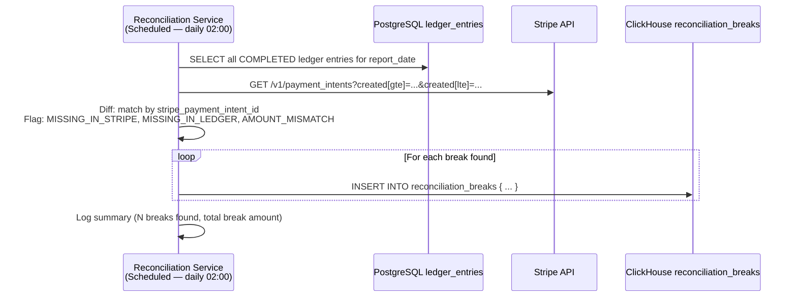

# AegisPay — Data Pipeline & Analytics Flow

The data pipeline moves event data from Kafka into ClickHouse for analytics. It operates entirely asynchronously and **never touches the payment critical path**.

---

## Pipeline Architecture

```
Kafka Topics                 Data Pipeline (8089)              ClickHouse
─────────────                ────────────────────────────      ─────────────────────
transaction.completed ──────▶ TransactionMetricsStream ──────▶ transaction_facts
transaction.failed    ──────▶                           │
                             │  map → TransactionFact   │
                             │  buffer in-memory        │
                                                        │
risk.assessment.completed ──▶ RiskAnalyticsStream ──────▶ risk_assessments
                             │  map → RiskRecord        │
                             │  buffer in-memory        │
                                                        │
transaction.completed ──────▶ (saga latency calc) ──────▶ saga_latencies
                                                        │
                                            ClickHouseSink
                                            flush every 5s (≥1 record)
                                                        │
                                                        ▼
                                            reconciliation_breaks
                                            (written directly by
                                             Reconciliation Service)
```

---

## ClickHouseSink Batch Flush

The sink collects records and flushes in two conditions:
- **Time-based**: every 5 seconds regardless of count
- **Count-based**: if buffer reaches 500 records before 5s (backpressure protection)

```java
// Simplified flush logic
void flushTransactionFacts() {
    if (transactionFacts.isEmpty()) return;
    List<TransactionFactRecord> batch = new ArrayList<>(transactionFacts);
    transactionFacts.clear();
    // Batch INSERT via ClickHouse JDBC
    // ON DUPLICATE NOTHING — idempotent
}
```

If ClickHouse is unavailable, the flush throws and records remain in the buffer. The next tick retries. Kafka consumer offsets are NOT committed until a successful flush — so if the service crashes mid-buffer, events are reprocessed from Kafka.

---

## Schema: Four ClickHouse Tables

### `transaction_facts`
Primary analytics table. One row per completed or failed transaction.

```sql
CREATE TABLE transaction_facts (
    transaction_id        UUID,
    user_id               UUID,
    amount                Decimal(18,4),
    currency              LowCardinality(String),
    status                LowCardinality(String),
    failure_code          Nullable(String),
    external_reference    Nullable(String),
    event_time            DateTime64(3,'UTC'),
    processing_latency_ms Int64,
    event_date            Date MATERIALIZED toDate(event_time),  -- partition key helper
    event_hour            UInt8 MATERIALIZED toHour(event_time)
)
ENGINE = MergeTree()
PARTITION BY toYYYYMM(event_date)
ORDER BY (event_date, currency, status, transaction_id)
TTL event_date + INTERVAL 2 YEAR;
```

### `risk_assessments`
One row per risk decision. Linked to `transaction_facts` by `transaction_id`.

```sql
CREATE TABLE risk_assessments (
    transaction_id UUID,
    user_id        UUID,
    risk_score     UInt8,          -- 0-100
    decision       LowCardinality(String),  -- ALLOW, REVIEW, BLOCK
    rule_flags     Array(String),  -- e.g. ["HIGH_VELOCITY", "NEW_DEVICE"]
    rule_count     UInt8 MATERIALIZED length(rule_flags),
    event_time     DateTime64(3,'UTC'),
    event_date     Date MATERIALIZED toDate(event_time)
)
ENGINE = MergeTree()
ORDER BY (event_date, decision, risk_score, transaction_id)
TTL event_date + INTERVAL 1 YEAR;
```

**Why `Array(String)` for rule_flags?** Avoids a join table. ClickHouse's `arrayJoin()` function unpacks the array for `GROUP BY` queries. The Fraud Intelligence dashboard uses `arrayJoin(rule_flags) AS rule_flag` to count individual flag occurrences.

### `saga_latencies`
One row per completed saga. Measures end-to-end transaction processing time.

```sql
CREATE TABLE saga_latencies (
    transaction_id UUID,
    saga_id        UUID,
    started_at     DateTime64(3,'UTC'),
    completed_at   DateTime64(3,'UTC'),
    latency_ms     Int64,
    final_status   LowCardinality(String)
)
ENGINE = MergeTree()
ORDER BY (event_date, final_status, latency_ms)
TTL event_date + INTERVAL 1 YEAR;
```

### `reconciliation_breaks`
Written by Reconciliation Service (not Data Pipeline). Represents discrepancies between AegisPay ledger and Stripe.

```sql
CREATE TABLE reconciliation_breaks (
    break_id        UUID DEFAULT generateUUIDv4(),
    report_date     Date,
    transaction_id  Nullable(UUID),
    stripe_pi_id    Nullable(String),
    ledger_amount   Nullable(Decimal(18,4)),
    stripe_amount   Nullable(Decimal(18,4)),
    break_amount    Decimal(18,4),      -- |ledger - stripe|
    currency        LowCardinality(String),
    break_type      LowCardinality(String),  -- AMOUNT_MISMATCH, MISSING_IN_LEDGER, MISSING_IN_STRIPE
    break_status    LowCardinality(String),  -- OPEN, RESOLVED, IGNORED
    resolved_at     Nullable(DateTime64(3,'UTC')),
    resolution_note Nullable(String),
    created_at      DateTime64(3,'UTC') DEFAULT now64()
)
ENGINE = MergeTree()
PARTITION BY toYYYYMM(report_date)
ORDER BY (report_date, break_type, break_status, break_amount)
TTL report_date + INTERVAL 3 YEAR;
```

---

## Three Materialized Views

Materialized views auto-aggregate as data lands. Grafana queries these for fast dashboard loads.

| View | Source Table | Aggregates |
|------|-------------|-----------|
| `mv_hourly_transaction_summary` | `transaction_facts` | COUNT, SUM(amount), AVG/P95/P99 latency per hour + currency + status |
| `mv_hourly_risk_summary` | `risk_assessments` | COUNT, AVG/P95 risk score per hour + decision |
| `mv_daily_reconciliation_summary` | `reconciliation_breaks` | COUNT, SUM(break_amount) per day + type + status |

---

## Reconciliation Flow



Reconciliation runs as a Spring Batch job. It waits for `ledger-service` to be healthy before starting (init-container in Helm).

---

## Grafana Dashboards (ClickHouse-backed)

| Dashboard | Key panels |
|-----------|-----------|
| **Payment Operations** | Total/failure rate/volume KPIs; hourly status bars; currency pie; failure code table; volume trend |
| **Fraud Intelligence** | Avg risk score; blocked/review KPIs; decision donut; score histogram; decisions over time; top rule flags |
| **SLA & Latency** | P50/P95/P99 saga latency KPIs; percentile trend; saga status breakdown; slowest sagas table; reconciliation breaks table |

All dashboards auto-refresh (1–5 min intervals) and use the `aegispay-clickhouse` datasource provisioned via `grafana-datasources` ConfigMap.
