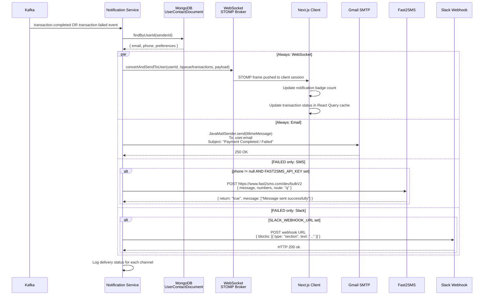

# AegisPay — Notification Flow

Notification Service delivers real-time and asynchronous notifications across four channels. Critically, **notification failure never blocks the payment flow** — the notification path is entirely asynchronous and downstream of the core saga.

---

## Notification Channels

| Channel | Transport | Trigger |
|---------|-----------|---------|
| **In-app (WebSocket)** | STOMP over WebSocket | COMPLETED + FAILED |
| **Email** | Gmail SMTP (JavaMailSender) | COMPLETED + FAILED |
| **SMS** | Fast2SMS Quick Route | FAILED only |
| **Slack** | Incoming Webhook | FAILED only |

---

## Sequence Diagram



---

## WebSocket Auth Deep Dive

WebSocket connections require authentication at the STOMP layer, not HTTP layer.

**Problem**: Spring Security's `permitAll()` for the WebSocket endpoint means the HTTP upgrade handshake succeeds unauthenticated. But `convertAndSendToUser(userId, ...)` routes by the STOMP session's **principal name** — if no principal is set, the message goes nowhere.

**Solution (`StompAuthChannelInterceptor`)**:

```
Client                        Notification Service
  │                                  │
  │──── HTTP GET /ws/info ──────────▶│ (SockJS handshake — no auth required)
  │◀─── 200 OK ──────────────────────│
  │                                  │
  │──── STOMP CONNECT ──────────────▶│
  │     headers:                     │
  │       Authorization: Bearer JWT  │  StompAuthChannelInterceptor.preSend()
  │                                  │  → parse JWT
  │                                  │  → extract aegispay_user_id claim
  │                                  │  → setUser(UsernamePasswordAuth)
  │◀─── STOMP CONNECTED ─────────────│
  │                                  │
  │──── STOMP SUBSCRIBE ────────────▶│
  │     /user/queue/transactions     │
  │                                  │
  │                           convertAndSendToUser("uid", "/queue/transactions", payload)
  │                                  │  → resolves to /user/uid/queue/transactions
  │◀─── STOMP MESSAGE ───────────────│
  │     { status, amount, ... }      │
```

---

## Contact Resolution

When a user registers, `UserRegisteredConsumer` stores contact details in MongoDB:

```
UserContactDocument {
  userId: UUID
  email:  String       ← full email for delivery
  phone:  String       ← E.164 format for SMS
  maskedEmail: String  ← shown in UI logs only
}
```

If a user's phone is `null` (not provided at registration), SMS is silently skipped. If `FAST2SMS_API_KEY` is blank, SMS is skipped. Either way, email and WebSocket still deliver.

---

## Stub Mode

Both Slack and Fast2SMS adapters run in **stub mode** when their API keys are not configured. Stub mode logs the notification body at INFO level and returns successfully — notification-service starts and functions normally without these keys.

This is intentional: in local dev you don't need a Slack workspace or an SMS account to develop features.

---

## Failure Isolation

Notification channels are dispatched in parallel within a `try-catch`. If Gmail SMTP returns a 550 error:
1. The error is logged at WARN level
2. SMS and Slack still attempt delivery
3. The WebSocket push (already sent) is unaffected
4. The main transaction is already COMPLETED — the failure only affects the notification, not money movement

---

## Notification Payload (WebSocket)

```json
{
  "transactionId": "550e8400-e29b-41d4-a716-446655440000",
  "status": "COMPLETED",
  "amount": "500.00",
  "currency": "INR",
  "recipientName": "Test Payee",
  "failureReason": null,
  "failureCode": null,
  "updatedAt": "2026-05-16T10:30:00Z"
}
```

On `FAILED`, `failureCode` is set (e.g., `amount_too_small`, `INSUFFICIENT_FUNDS`, `RISK_BLOCKED`) and displayed in the AI-powered error explanation panel.
