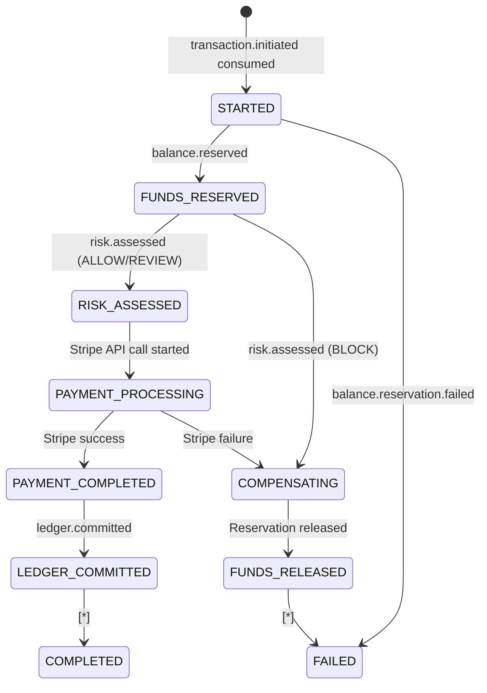

# AegisPay — Saga Pattern Deep Dive

The Saga pattern solves the hardest problem in distributed systems: **how to execute a multi-step operation across multiple services with guaranteed rollback if any step fails, without using a distributed 2-phase commit.**

---

## Why Not 2PC (Two-Phase Commit)?

2PC requires all participants to hold locks while the coordinator decides. If the coordinator crashes between "prepare" and "commit", every participant holds its lock indefinitely — a distributed deadlock.

In a payment system, holding a lock on the ledger table while waiting for Stripe to respond would make the ledger unavailable for all other payments. Unacceptable.

**Saga's answer**: instead of locks, use compensating transactions. If step N fails, execute compensating steps N-1, N-2, … to undo what was done so far.

---

## AegisPay's Orchestrated Saga

AegisPay uses **orchestration** (not choreography): the Payment Orchestrator is the single coordinator that knows the full sequence. Contrast with choreography where each service listens for events from the previous service — choreography creates implicit coupling and makes the sequence hard to reason about or change.

```
PaymentOrchestrator (Saga Coordinator)
│
├─▶ Step 1: RESERVE_FUNDS
│     Request:  Publish balance.reservation.requested
│     Response: balance.reserved OR balance.reservation.failed
│     Compensate: Release reservation (balance.reservation.released)
│
├─▶ Step 2: ASSESS_RISK
│     Request:  (Risk Engine auto-consumes balance.reserved)
│     Response: risk.assessed { decision }
│     Compensate: none (read-only step)
│
├─▶ Step 3: EXECUTE_PAYMENT
│     Request:  Call Stripe API directly (sync)
│     Response: PaymentResult { success, externalReference, failureCode }
│     Compensate: Stripe Refund API
│
├─▶ Step 4: COMMIT_LEDGER
│     Request:  Publish payment.completed
│     Response: ledger.committed
│     Compensate: Ledger reversal entries
│
└─▶ SAGA COMPLETED
```

---

## Saga State Transitions



---

## Saga Persistence (aegispay_sagas DB)

The saga state is persisted to the `aegispay_sagas` PostgreSQL database so the orchestrator can survive restarts:

```sql
-- Simplified schema
CREATE TABLE sagas (
    id              UUID PRIMARY KEY,
    transaction_id  UUID NOT NULL UNIQUE,
    current_step    VARCHAR(50) NOT NULL,
    status          VARCHAR(20) NOT NULL,  -- RUNNING, COMPLETED, COMPENSATING, FAILED
    started_at      TIMESTAMP,
    completed_at    TIMESTAMP,
    payload         JSONB,    -- current step input/output
    version         INTEGER   -- optimistic locking
);
```

On restart, the orchestrator queries for `RUNNING` sagas and resumes from the last persisted step.

---

## Compensating Transactions

Compensating transactions must be:
1. **Idempotent** — the compensating action might be replayed
2. **Eventually consistent** — compensation may complete seconds/minutes after the failure
3. **Logged** — every compensation is recorded as a ledger entry for audit purposes

| Step failed | Compensation |
|-------------|-------------|
| Risk BLOCK | Release ledger reservation → `UPDATE accounts SET reserved_balance -= amount` |
| Stripe failure | Release reservation |
| Ledger commit failure | Issue Stripe refund via Refund API, then release reservation |

---

## Saga Timeout Handling

Sagas have a maximum duration (configurable, default 5 minutes). If a saga exceeds this:
1. `SagaTimeoutAlert` is fired by Prometheus rule `SagaTimeoutRateHigh`
2. Orchestrator marks saga as TIMED_OUT and triggers compensation chain
3. Transaction status → FAILED with `failureCode=SAGA_TIMEOUT`
4. User receives FAILED notification

---

## Saga Latency Measurement

Every completed saga writes to ClickHouse `saga_latencies` table:

```
transaction_id | saga_id | started_at | completed_at | latency_ms | final_status
```

The SLA & Latency Grafana dashboard shows P50/P95/P99 saga latency. Alerting fires when P99 exceeds 10 seconds.

---

## Saga vs. Direct REST Calls

| Aspect | Direct REST (bad approach) | Saga (AegisPay approach) |
|--------|--------------------------|--------------------------|
| Ledger locked during Stripe call | Yes — Stripe can take 2-10s | No — reservation is non-blocking |
| Crash recovery | No — partial state left behind | Yes — saga resumes from last step |
| Rollback | No | Yes — compensating transactions |
| Observability | Hard — call chain is implicit | Clear — every step is an event |
| Latency coupling | Yes — all services must be up | No — event-driven, async steps |
