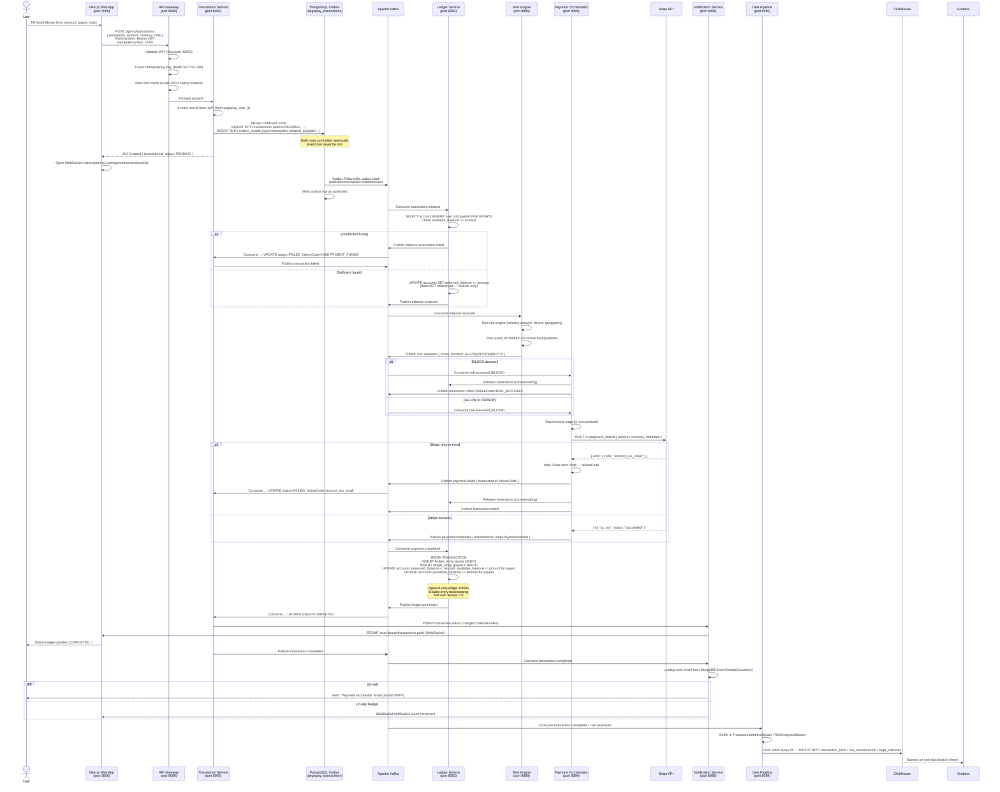

# AegisPay — End-to-End Transaction Flow

This document traces every step from "user taps Send Money" to "both balances updated and notifications delivered."

---

## Sequence Diagram



---

## State Machine

```
PENDING → RESERVED → RISK_CLEARED → PROCESSING → COMPLETED
                                                 ↘
              PENDING → FAILED (at any stage)
```

| Transition | Triggered by | Responsible service |
|-----------|-------------|---------------------|
| PENDING → RESERVED | `balance.reserved` consumed | Transaction Service |
| RESERVED → RISK_CLEARED | `risk.assessed (ALLOW)` consumed | Transaction Service |
| RISK_CLEARED → PROCESSING | Saga starts Stripe call | Payment Orchestrator |
| PROCESSING → COMPLETED | `ledger.committed` consumed | Transaction Service |
| Any → FAILED | Any failure event | Transaction Service |

---

## Idempotency Deep Dive

Three layers protect against duplicate execution:

1. **API Gateway** — `Idempotency-Key` header checked against Redis with `SET NX PX 86400000`. Second request with same key returns the cached response immediately without hitting Transaction Service.

2. **Outbox table** — `external_idempotency_key` has a `UNIQUE` constraint. A duplicate `INSERT` raises a DB constraint error, which Transaction Service catches and returns the existing transaction.

3. **Kafka consumers** — every consumer checks if the event's `transactionId` has already been processed (MongoDB `_id` uniqueness or Postgres `ON CONFLICT DO NOTHING`) before applying side effects.

---

## Failure Recovery

| Failure scenario | Recovery mechanism |
|-----------------|-------------------|
| Transaction Service crashes after INSERT but before Kafka publish | Outbox relay retries; event published on next poll (≤5s) |
| Ledger Service down when event arrives | Kafka consumer group lag builds; Ledger processes backlog when it recovers |
| Stripe API timeout | Payment Orchestrator saga has a timeout; triggers compensating transaction (release reservation) |
| ClickHouse sink error | Data Pipeline buffers in memory; retries with exponential backoff; Kafka consumer lag accumulates — no data loss |
| Notification delivery failure | Logged as warning; other channels still attempt delivery; never blocks main transaction flow |
